## アロー関数

- アロー関数を使うと関数の記述を簡略化する事が出来る

- 引数が一つの場合は、()はいらないが 2 つ以上の場合は、下記のようになる
  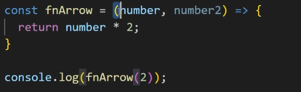

- 関数は末尾に()をつける事で実行するという意味なる
- return は関数の呼び出し元(関数が実行された場所)に返るという意味になる
- オブジェクトを戻り値としてそのまま返したい場合は、()の中にオブジェクトリテラルを書く必要がある
  

## コールバック関数とは

- コールバック関数とは引数に渡された関数の事を指す
  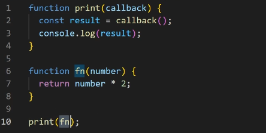

- debugger を記述すると処理が記述した位置で止まる
  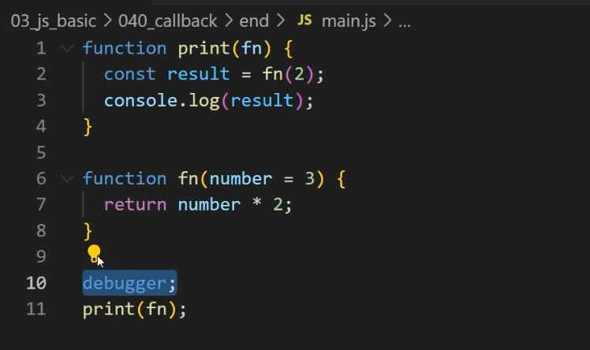

## DOM とは

- DOM とは HTML の一つずつのタグ<h1></h1>となる
- それぞれのタグは DOM オブジェクトに紐づいていて、javascript 上ではタグが使えない為、DOM のオブジェクトを通して HTML を操作します
- console.dir()で要素の DOM オブジェクトが取れてくる

## Array オブジェクトのメソッドの使い方

- 配列の map メソッドとフィルターメソッドの使い方

- map メソッドは登録されたコールバック関数が配列の要素を一つ一つに対して実行されることになる
- その時の要素が val に渡ってこのコールバック関数が返す値というのが新しい配列の要素として登録される
  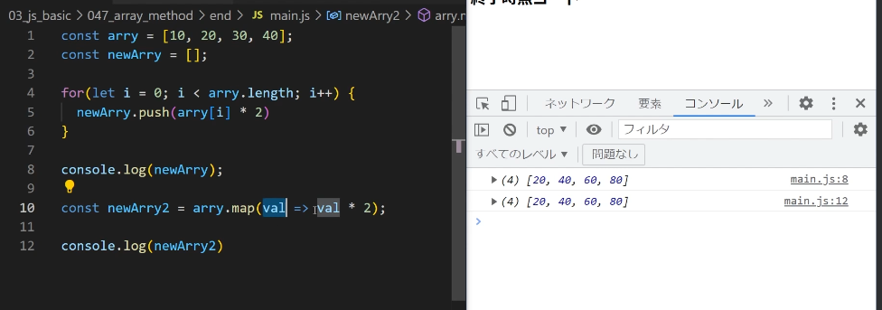

- フィルターメソッドの場合、コールバック関数関数がリターンする値が TRUE であれば新しい要素として配列に追加される
  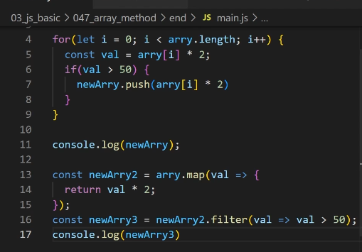

## 分割代入について学ぼう

- 分割代入とは、配列やオブジェクトの特定の要素を変数として抽出する方法
  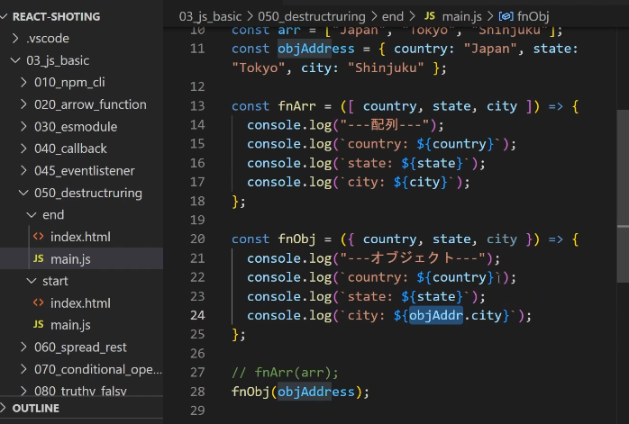

## スプレッド演算子とは

- 配列を展開して関数に渡したり配列を展開したものを別の配列にコピーするときに使用する
  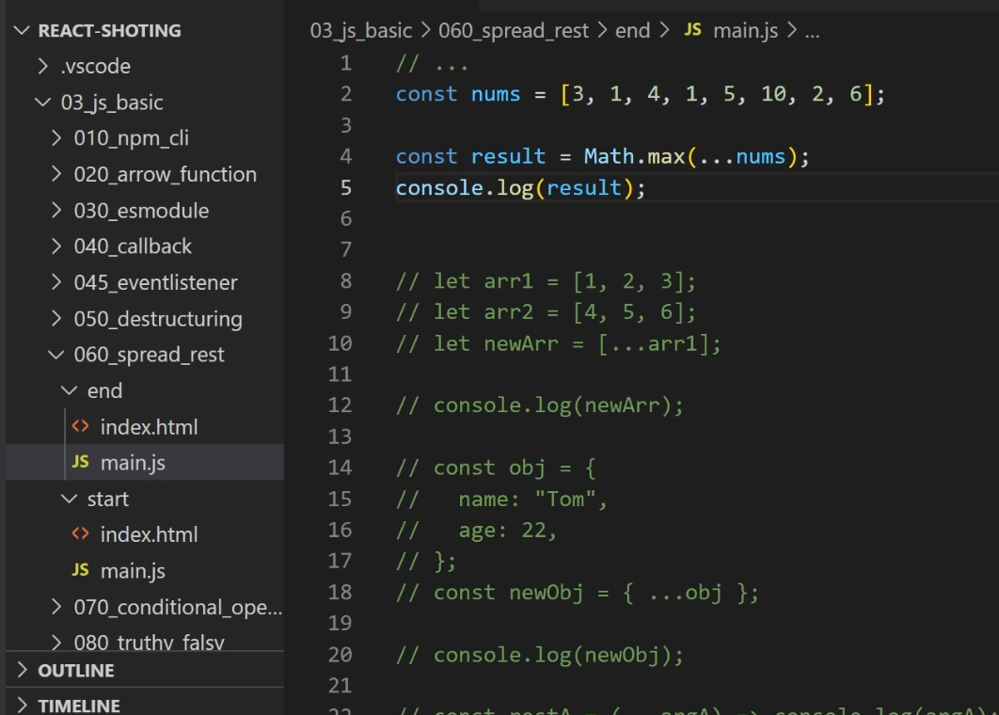

## 三項演算子とは

- ( ?: )のこと
  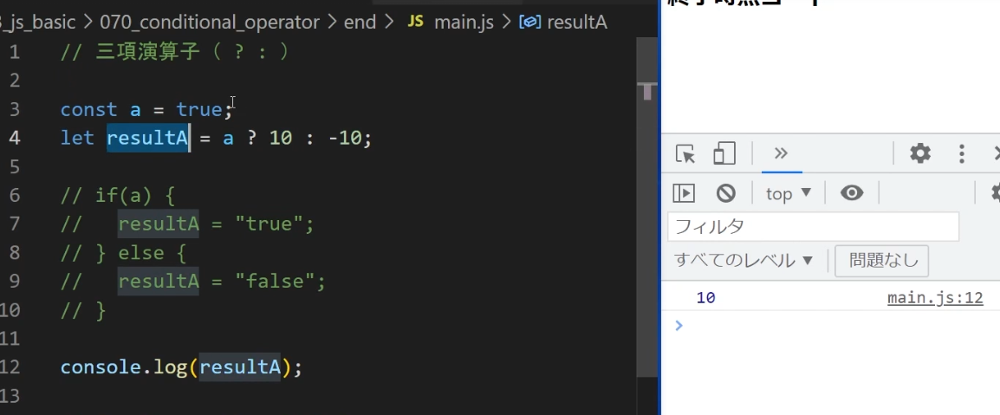

## truthy と falsy とは

- falsy は真偽値に変換した際に"偽(false)"とみなされる値のことで truthy はそれ以外
  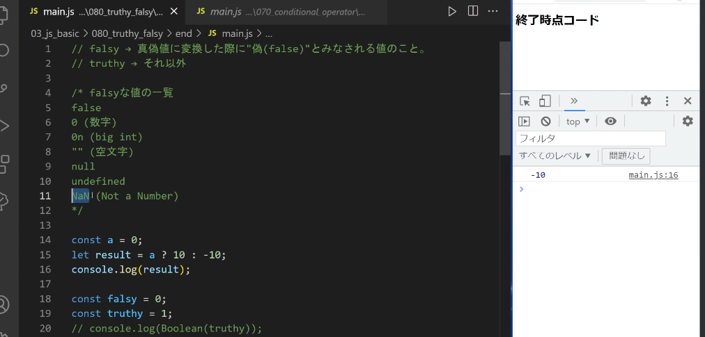

## 非同期処理(promise)を使ったハンドリング

- 変数に値を代入したり中身を見たりする等の処理は同期処理と呼ばれる
- 同期処理の特徴としてはコードが呼ばれた順番に処理が完了していく

- 非同期処理とは setTimeout の中のコールバック関数が非同期処理ということになる
- コードが記載された順番通りに処理が行われないものを非同期処理
  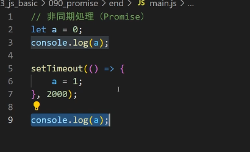

## await/async とは

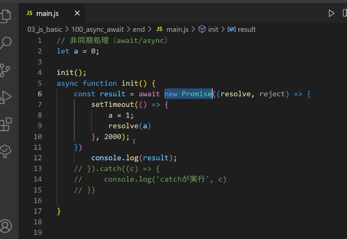

- await/async を使う場合にエラーが発生した際の処理を記述する場合は、trycatch で囲むことになる
