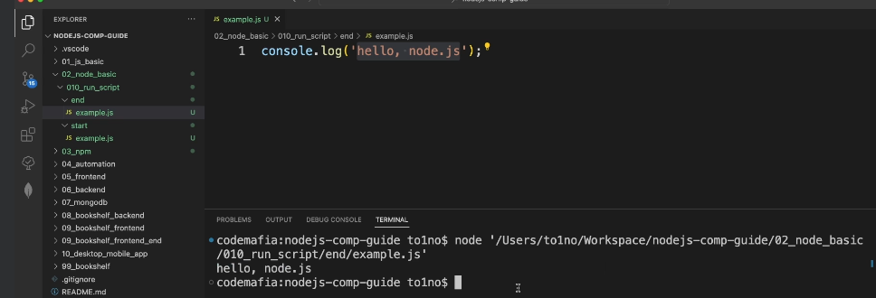
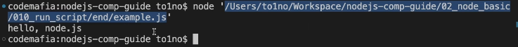
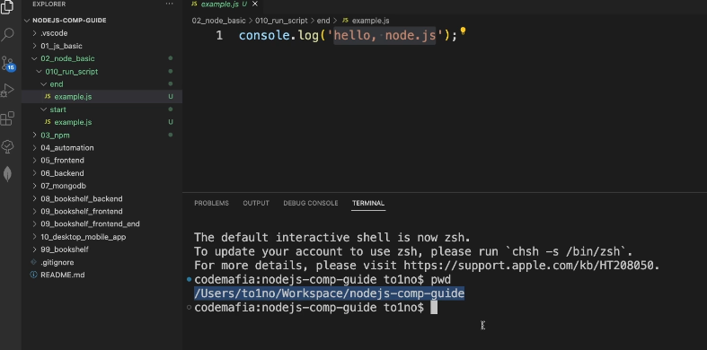
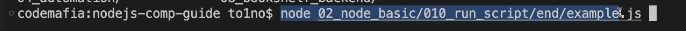
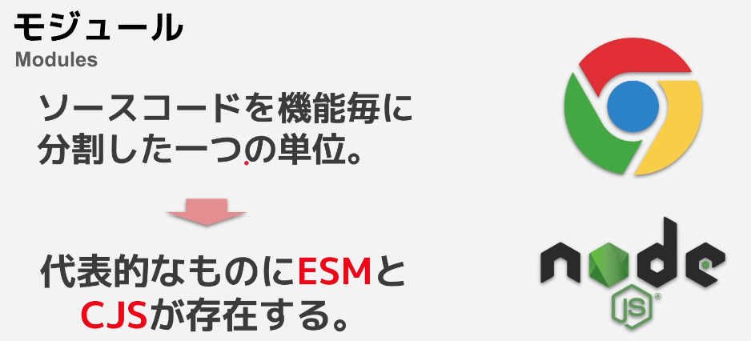
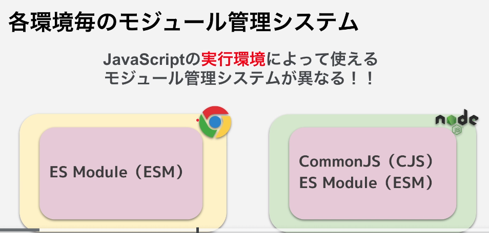
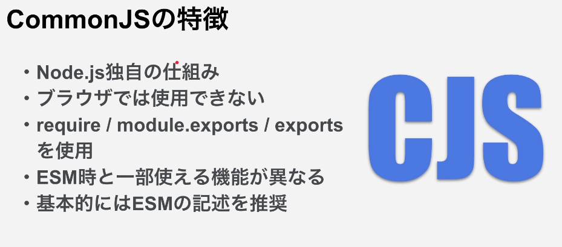
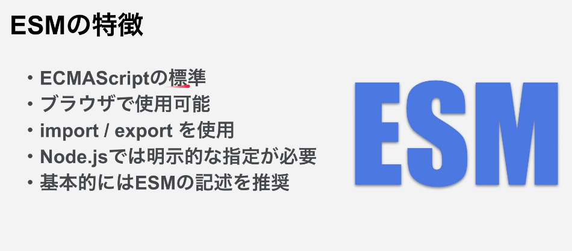

## Volta とは

https://docs.volta.sh/guide/getting-started

- コマンド一つでインストールする node.js のバージョンを切り替えることが出来る

## Node.js のバージョンの意味

- Node.js の偶数のバージョンは長期サポートが保証されているバージョンとなり、奇数のバージョンは古いものは削除される

## Node.js でコードを実行

- Node.js で script を実行するには Terminal を使用する



- ファイル実行コマンド

```
node　"ファイルパス"
```

- 絶対パスとは PC のルートディレクトリからそのファイルまでのこと



- 相対パスとは現在のカレントディレクトリからそのファイルまでのこと
- カレントディレクトリとは現在開いているパスのこと
- pwd コマンドを使用すると現在のターミナルが開いているパスが表示される



- 相対パスで script を実行



- 相対パスでファイルを指定する場合は、/をつけないか./とすると相対パスで指定するということになる

## Terminal の基本的な使い方を学ぶ

```
/**
 * - 絶対パス
 *   ルートディレクトリからファイルまでのパス
 *   例） / や c: などから始まる
 *
 * - 相対パス
 *   カレントディレクトリ、または実行中のファイルからのパス
 *   例）
 *   ./ or /なし or ドライブ（c:）の指定なし  -> 現在のディレクトリからの指定
 *   ../  -> 親のディレクトリを示す
 *
 * - カレントディレクトリ
 *   コマンドライン（ターミナル）上で現在開いているパス
 *   `pwd` で確認可能
 *
 * - CDコマンド（Change Directory）
 *   カレントディレクトリを変更するコマンド
 *   例）
 *   cd フォルダ名  -> 指定したフォルダに移動（相対パス、絶対パスで指定可能）
 *   cd ..        -> 親のフォルダに移動
 *
 * - LSコマンド（List）
 *   カレントディレクトリ内のファイルやフォルダの出力
 *
 */
```

## **dirname と**filename ファイルに文字を書き込む

- ファイルへの書き込みはモジュールを一つ import する必要があり、ESmodule と comon.js という 2 つのファイルの管理システムがある
- デフォルトは comonjs を使ってファイルをインポートする

- dirname という変数はあらかじめ準備してくれる変数となる

## Node.js の基礎モジュール管理システムについて





