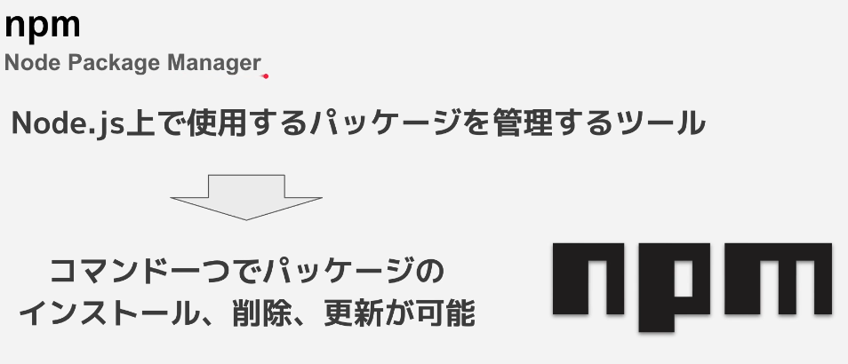
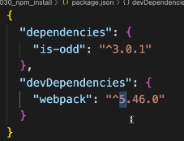

## npm とは



- version について



```
5.46.0

5はメジャーバージョンと呼ばれ明確なインターフェースが変更、大幅な機能変更があった場合

46はマイナーバージョンと呼ばれ新しい機能が追加されている
マイナーバージョンが上がっても後方互換は保たれる為、既存のコードに修正は必要ない

0の数値はパッチバージョンと呼ばれ、バグの修正やセキュリティー的な脆弱性に対応するための修正が入った時に上がる

```
